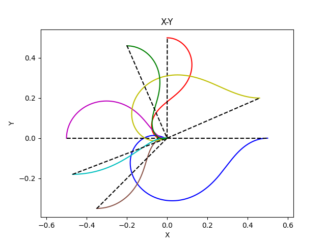

# 🚗 Differential-Drive P Controller

A simple **P (Proportional) Controller** implementation for a **Differential-Drive Robot**.  
The project demonstrates how a robot starting from different initial positions can navigate toward the origin point **(0, 0)** using a proportional control strategy.

---

## 📌 Features
- Implementation of **P Controller** for differential-drive kinematics.  
- Simulation of robot trajectories starting from multiple initial positions.  
- Visualization of results with **matplotlib**.  
- Lightweight and easy-to-understand Python code (no external robotics libraries required).  

---

## 🛠️ Requirements
Make sure you have the following installed:

- Python 3.7+
- [NumPy](https://numpy.org/)
- [Matplotlib](https://matplotlib.org/)

You can install the dependencies using:

```bash
pip install -r requirements.txt
```

---

## 🚀 Usage
1. Clone this repository or download the project:
   ```bash
   git clone https://github.com/Mohammad-Momeni/Differential-Drive-PController
   cd Differential-Drive-PController
   ```

2. Run the main script:
   ```bash
   python PController.py
   ```

3. The program will display the simulation results and save a plot of the trajectories.

---

## 📊 Results
Below is an example output showing the paths obtained from different starting points converging to the origin (0, 0):



---

## 📂 Project Structure
```
.
├── PController.py   # Main Python implementation
├── Result.png       # Example simulation output
└── README.md        # Project documentation
```

---

## 📜 License
This project is licensed under the MIT License.  
Feel free to use and modify it for your own projects.
